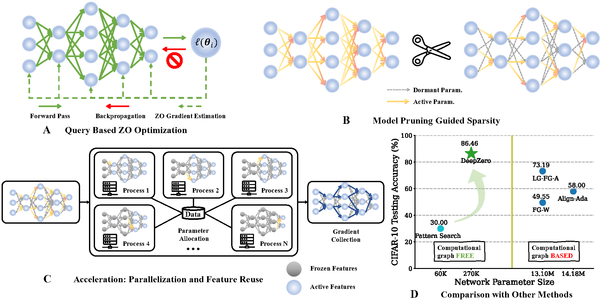

# \[ICLR'24\] DeepZero: Scaling up Zeroth-Order Optimization for Deep Model Training

[](https://opensource.org/licenses/MIT)

["DeepZero: Scaling up Zeroth-Order Optimization for Deep Model Training"](https://arxiv.org/abs/2310.02025)

Zeroth-order (ZO) optimization has become a popular technique for solving machine learning (ML) problems when first-order (FO) information is difficult or impossible to obtain. However, the scalability of ZO optimization remains an open problem: Its use has primarily been limited to relatively small-scale ML problems, such as sample-wise adversarial attack generation. To our best knowledge, no prior work has demonstrated the effectiveness of ZO optimization in training deep neural networks (DNNs) without a significant decrease in performance. To overcome this roadblock, we develop DeepZero, a principled ZO deep learning (DL) framework that can scale ZO optimization to DNN training from scratch through three primary innovations. First, we demonstrate the advantages of coordinate-wise gradient estimation (CGE) over randomized vector-wise gradient estimation in training accuracy and computational efficiency. Second, we propose a sparsity-induced ZO training protocol that extends the model pruning methodology using only finite differences to explore and exploit the sparse DL prior in CGE. Third, we develop the methods of feature reuse and forward parallelization to advance the practical implementations of ZO training. Our extensive experiments show that DeepZero achieves state-of-the-art (SOTA) accuracy on ResNet-20 trained on CIFAR-10, approaching FO training performance for the first time. Furthermore, we show the practical utility of DeepZero in applications of certified adversarial defense and DL-based partial differential equation error correction, achieving 10-20% improvement over SOTA. We believe our results will inspire future research on scalable ZO optimization and contribute to advancing DL with black box.



## Pipeline

In general, prune at initialization (ZO-GraSP) first, and then train the model with sparse-CGE based ZO method distributedly 

Training details:

1. calculate $f(\theta)$ (with intermediate features) in the main process

2. send intermediate features to subprocesses to calculate $\frac{f(\theta + \mu \cdot e_i) - f(\theta)}{\mu}$ distributedly

3. wait for the result from each subprocess to concatenate the whole gradients

4. update the network in the main process

## Code Structure

+ algorithm

  + prune: pruning at initialization algorithms, usage: `from algorithm.prune import global_prune`
  
  + zoo: zeroth order optimization algorithms
    
    + gradient_estimate.py: single process RGE and CGE
    
    + distributed_cge.py: distributed CGE related algorithm, implemented using `torch.distributed.rpc`
    
+ analysis: tools for conveniently getting the experiment results

+ data: getting data loaders and the class number information, usage: `from data import prepare_dataset`

+ experiments: main executable files

  + generate_layer_ratio.py: initialization pruning. example usage: `python experiments/generate_layer_ratio.py --network resnet20 --method zo_grasp --sparsity 0.9`

  + sparse_gradient_training.py: the distributed cge training. example usage: `python experiments/sparse_gradient_training.py --network resnet20 --dataset cifar10 --score layer_wise_random --sparsity 0.9 --sparsity-ckpt zo_grasp_0.9 --gpus 0,1 --lr 0.1 --master-port 29500`
  NOTE: When multiple jobs are running, please assign different master ports.
  
+ models:

  + distributed_model.py: defines how subprocess react to the signal of the main process
  
  + resnet_s.py: resnet small models with feature reuse
  
+ scripts

+ tools

+ cfg.py: path configs

## Contributors

[Aochuan Chen](https://scholar.google.com/citations?user=7pY-Ie8AAAAJ&hl=en)

[Yimeng Zhang](https://damon-demon.github.io/)

[Jinghan Jia](https://jinghanjia.netlify.app/)

## Citation

```
@article{chen2023deepzero,
  title={DEEPZERO: SCALING UP ZEROTH-ORDER OPTIMIZATION FOR DEEP MODEL TRAINING},
  author={Chen, Aochuan and Zhang, Yimeng and Jia, Jinghan and Diffenderfer, James and Liu, Jiancheng and Parasyris, Konstantinos and Zhang, Yihua and Zhang, Zheng and Kailkhura, Bhavya and Liu, Sijia},
  journal={arXiv preprint arXiv:2310.02025},
  year={2023}
}
```
